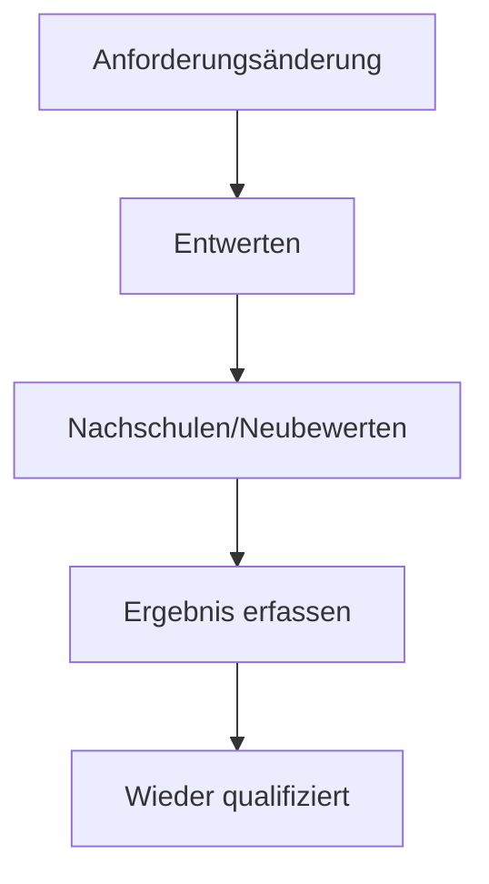

Im folgenden Abschnitt sind Best Practices und typische Aufgaben beschrieben, die durchgeführt werden können.

## Was kann ich als normaler Nutzer in dieser App machen?

Als normaler Nutzer, mit der **Standard-Berechtigung**, kann ihnen diese App in vielen Aspekten helfen und Antworten auf verschiedene Fragen liefern.
Der Einstiegspunkt für die Beantwortung dieser Fragen ist immer das eigene Profil in der App **Aufgaben & Qualifikationen**. Dieses erreichen Sie, indem Sie in der Seitenleiste auf den Eintrag **Mein Qualifikationsprofil** klicken.

Auf der nächsten Seite erscheint dann Ihr persönliches Qualifikationsprofil. Die Details zu diesem Profil werden in den folgenden Abschnitten beschrieben.

### Was ist meine Stellenbeschreibung?

In der linken Spalte (1) haben Sie Einblick in Ihr Stellenprofil.
Sie könnten sowohl ihr gesamtes Stellenprofil unter **Details anzeigen** einsehen, als auch nur die Beschreibung für jede einzelne Position, falls Sie über mehrere Positionen verfügen sollten.

### Welche Aufgaben habe ich auf Basis meiner Stellenbeschreibung zu erfüllen?

Aus Ihren Positionen sowie der manuellen Zuordnung von Aufgaben ergeben sich die Tätigkeiten, die Sie innerhalb der Organisation ausführen sollen.
Diese können Sie unter dem Tab **Aufgaben** einsehen. Manuell zugeordnete Aufgaben sind dabei an dem grünen Handsymbol zu erkennen.

### Über welche Qualifikationen soll ich verfügen, um meinen Aufgaben gerecht zu werden?

In der rechten Spalte (2) sehen Sie alle Qualifikationen, die für Ihre Aufgaben gefordert werden. Zusätzlich sehen Sie hier auch die Qualifikationen, über die Sie verfügen.
Die erforderlichen Qualifikationen sind mit dem Info Badge Benötigt versehen.

### Welche Qualifikationen habe ich aktuell und wie lange sind diese gültig?

Qualifikationen, über die Sie verfügen, werden mit weiteren Details dargestellt. In der ersten markierten Zeile ist die Qualifikation **Akademischer Abschluss** dargestellt.
Diese Qualifikation ist zu 100% vorhanden (Spalte Eignung) jedoch bereits abgelaufen.
Qualifikationen können mit der Zeit ablaufen, wenn z.B. festgelegt ist, dass diese regelmäßig überwacht und oder erneut erworben werden sollen.
Da diese Qualifikation auf Grund ihrer Aufgaben nicht benötigt wird, besteht hier kein Handlungsbedarf.

In der zweiten markierten Zeile **Baggerführerschein** ist eine Qualifikation dargestellt, die ebenfalls zu 100% vorhanden und zusätzlich auch noch nicht abgelaufen ist.
Hier besteht also kein Handlungsbedarf.

Sollte Handlungsbedarf bei eine Qualifikation bestehen und Sie dokumentieren wollen, dass Sie über diese Qualifikation verfügen, dann klicken Sie bitte auf das Kebab-Menü (3) und wählen Sie dort den Eintrag **Neues Qualifikationsereignis hinzufügen** aus.

## Was kann ich als Vorgesetzter oder Administrator in dieser App machen?

Als Vorgesetzter oder Administrator besteht Ihr Ziel in der Regel nicht nur aus der Aktualisierung Ihres eigenen Qualifikationsprofils, sondern auch dem weiterer Kollegen und Mitarbeiter.
Hierzu bietet es sich an, als Einstiegspunkt z.B. die Qualifikationsmatrix auszuwählen. Hierzu klicken Sie in der linken Spalte auf **Qualifikationsmatrix**.

In der Qualifikationsmatrix sehen sie dann alle Personen, auf die Sie Zugriff haben.
Das kann entweder die ganze Organisation oder auch nur eine Teilmenge der Mitarbeiter sein. Sollten Sie nur eine Teilmenge der sichtbaren Mitarbeiter beurteilen wollen, können Sie die sichtbaren Mitarbeiter über die Filter nochmals weiter reduzieren.

:::info
Die erstellten Filter können Sie auch jederzeit als [Smart Views](/docs/faqs/smart-views) abspeichern, um somit immer schnell zu der Auswahl zu gelangen, die für Sie interessant ist.
:::

Zur Erklärung der Symbolik innerhalb der Qualifikationsmatrix schauen Sie bitte in den Abschnitt [Qualifikations-Matrix](/docs/apps/aufgaben-und-qualifikationen/qualifikationen).
Um einen schnellen Überblick über die anstehenden Aufgaben zu erhalten, können Sie auch zum Reiter **Dashboard** wechseln.

Hier sehen Sie dann den aktuellen Status der Qualifikationen für die ausgewählte Teilgruppe. Fokussieren Sie sich hier am besten auf die Kennzahl **Vorhandene erforderliche Qualifikationen**.
Um dann den Qualifikationsstatus zu verbessern, gibt es verschiedene Vorgehensweisen.

1. Sie gehen über das jeweilige Mitarbeiterprofil und fügen fehlende Qualifikationen [hinzu](#welche-qualifikationen-habe-ich-aktuell-und-wie-lange-sind-diese-gültig).
2. Sie gehen über eine Qualifikationen mit Handlungsbedarf und fügen dort Personen hinzu. Klicken Sie hierfür auf eine der Qualifikationen (2). Auf der Detailseite der Qualifikationen wählen Sie dann den Reiter **Personen** aus.
   Hier klicken Sie dann auf den Button **Person hinzufügen**, um mehrere Personen einer Qualifikation hinzuzufügen.
   

### Qualifikation entwerten

Wenn sich die Anforderungen an eine Qualifikation ändern, kann ein Administrator die Qualifikation einer Person entwerten. Die Person gilt ab dem festgelegten Datum als **Nicht qualifiziert**.

Die vollständige Historie bleibt erhalten, sodass der Qualifikationsstatus auch rückwirkend nachvollzogen werden kann.

> **Wichtig:** Die Entwertung erfolgt manuell.

#### Berechtigungen

Nur folgende Benutzer können Qualifikationen entwerten, wiederqualifizieren oder korrigieren:

- **Globaler Administrator**
- **Administrator Qualifikationsmatrix**

Benutzer mit Leserechten für die Person können deren Status und Historie einsehen.

#### Qualifikation entwerten

1. Öffnen Sie die Person unter **Aufgaben & Qualifikationen > Qualifikationsmatrix**.
2. Wählen Sie die betreffende Qualifikation.
3. Wählen Sie **Qualifikation ungültig machen**.
4. Geben Sie folgende Angaben ein:

   - **Kategorie:** Intern oder Extern
   - **Grund:** Beschreibung der Anforderungsänderung
   - **Gültig ab:** Datum, ab dem die Qualifikation nicht mehr gültig ist

5. Bestätigen Sie die Entwertung.

Die Qualifikation wird ab dem angegebenen Datum als **Nicht qualifiziert – Entwertet** angezeigt und nicht mehr als gültig berücksichtigt.

Eine Entwertung kann rückwirkend erfolgen, darf aber nicht vor dem Erwerb der Qualifikation liegen. Ein zukünftiges Datum ist nicht zulässig.

#### Nach der Entwertung

Eine entwertete Qualifikation bleibt ungültig, bis eine erfolgreiche Nachschulung oder Neubewertung erfasst wurde.

Wenn die Qualifikation während der Entwertung zusätzlich abläuft, bleibt der Grund **Entwertet**. Nach einer erfolgreichen Wiederqualifizierung gelten wieder die normalen Ablaufregeln.

#### Wiederqualifizieren

Nach einer erfolgreichen Nachschulung oder Neubewertung kann ein Administrator die Qualifikation wieder gültig machen.

1. Öffnen Sie die entwertete Qualifikation.
2. Wählen Sie die Aktion zum Erfassen der Nachschulung bzw. Neubewertung.
3. Erfassen Sie:

   - **Ergebnis**
   - **Kategorie**
   - **Grund**
   - **Gültig ab**
   - optional einen **Nachweis**

4. Speichern Sie ein erfolgreiches Ergebnis.

Die Qualifikation wird ab diesem Datum wieder als **Qualifiziert** geführt.

Das Datum darf weder in der Zukunft noch vor dem Entwertungsdatum liegen. Bei einem nicht bestandenen oder noch ausstehenden Ergebnis bleibt die Qualifikation entwertet.

#### Qualifikationshistorie

Die Historie zeigt alle relevanten Statusänderungen, einschließlich:

- Erwerb
- Entwertung
- Wiederqualifizierung
- Korrekturen

Zu den Einträgen werden, sofern vorhanden, unter anderem **Datum, Benutzer, Kategorie, Grund und Nachweis** angezeigt.

Historische Einträge werden nicht gelöscht oder überschrieben.

#### Status zu einem bestimmten Datum prüfen

Der Qualifikationsstatus kann für einen beliebigen vergangenen Kalendertag geprüft werden.

Beispiel:

| Datum       | Status                             |
| ----------- | ---------------------------------- |
| 10. Oktober | **Qualifiziert**                   |
| 18. Oktober | **Nicht qualifiziert – Entwertet** |
| 25. Oktober | **Qualifiziert**                   |

Vor dem erstmaligen Erwerb lautet der Status **Nicht qualifiziert – Nicht erworben**.

Nach dem Ablauf einer Qualifikation lautet der Status **Nicht qualifiziert – Abgelaufen**, sofern keine aktive Entwertung besteht.

#### Entwertung korrigieren

Eine fehlerhafte Entwertung wird nicht gelöscht. Stattdessen kann ein Administrator eine **Korrektur** erfassen.

Die Korrektur benötigt:

- **Grund**
- **Gültig ab**

Sie verändert den Status ab diesem Datum, während der ursprüngliche Eintrag in der Historie erhalten bleibt.

Das Korrekturdatum darf nicht in der Zukunft liegen.

#### Mehrere Personen gleichzeitig entwerten

Eine Qualifikation kann für mehrere Personen in einem Schritt entwertet werden.

1. Öffnen Sie die betreffende Qualifikation.
2. Wählen Sie die betroffenen Personen aus.
3. Geben Sie eine gemeinsame **Kategorie** und **Begründung** an.
4. Bestätigen Sie die Entwertung.

Jede Person erhält einen eigenen Historieneintrag.

Personen, deren Qualifikation bereits entwertet ist oder aus einem anderen Grund nicht verarbeitet werden kann, werden übersprungen. Der jeweilige Grund wird angezeigt.

#### Nach Status filtern

In Qualifikationsübersichten können Sie nach folgenden aktuellen Status filtern:

- **Qualifiziert**
- **Nicht qualifiziert**

Für **Nicht qualifiziert** wird zusätzlich der Grund angezeigt:

- **Nicht erworben**
- **Entwertet**
- **Abgelaufen**

Bei mehreren Qualifikationen bleibt eine Person sichtbar, wenn mindestens eine der angezeigten Qualifikationen dem ausgewählten Status entspricht.

#### Wichtige Regeln

- Die Entwertung erfolgt manuell.
- Nur Globale Administratoren und Administratoren der Qualifikationsmatrix können Statusänderungen vornehmen.
- Eine bereits entwertete Qualifikation kann nicht erneut entwertet werden.
- Eine nicht entwertete Qualifikation kann nicht wiederqualifiziert werden.
- Entwertungs- und Wiederqualifizierungsdaten dürfen nicht in der Zukunft liegen.
- Eine Wiederqualifizierung darf nicht vor dem Entwertungsdatum liegen.
- Historische Einträge werden nicht gelöscht oder überschrieben.
- Nachweise für Neubewertungen sind optional.
- Eine fehlgeschlagene oder ausstehende Neubewertung stellt die Qualifikation nicht wieder her.

#### Ablauf

